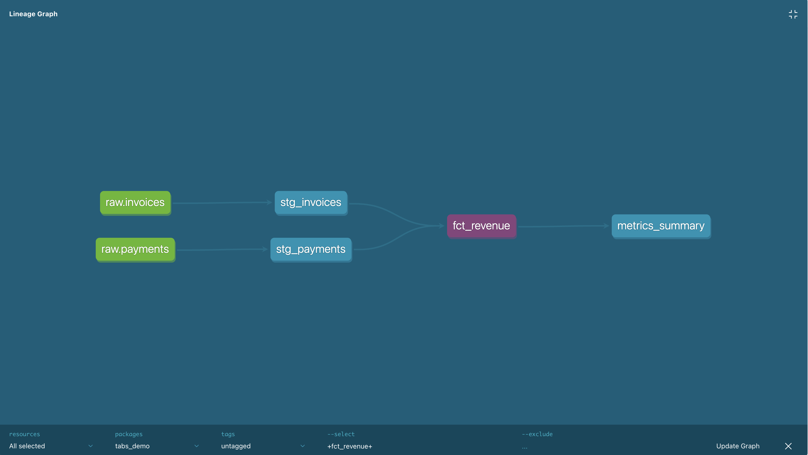

# Tabs Revenue Analytics Pipeline

A mock data stack built to demonstrate how I'd approach the first data engineer role at Tabs.

Tabs automates the contract-to-cash lifecycle. The data infrastructure underneath that — pipelines, models, metrics, quality checks — is what this project is about.

---

## What I built

A complete pipeline from raw business data to production-ready revenue metrics:

- **Generated** synthetic contract-to-cash data — customers, contracts, invoices, payments
- **Loaded** it into Snowflake as raw tables
- **Transformed** it with dbt into clean, analytics-ready models
- **Tested** data quality automatically — uniqueness, nullability, referential integrity
- **Surfaced** the metrics a finance team at Tabs would actually care about

---

## The metrics this answers

| Metric | Business question |
|--------|-------------------|
| `total_arr` | How much annual recurring revenue do we have? |
| `mrr` | What's our monthly run rate? |
| `active_customers` | How many customers are live on active contracts? |
| `collections_rate_pct` | What percentage of invoiced revenue has actually been collected? |
| `avg_days_to_collect` | How long does it take customers to pay after an invoice is issued? |

---

## How the data flows



Raw tables → Staging (cleaned) → `fct_revenue` (invoices joined to payments) → `metrics_summary` (single row of KPIs)

Every arrow in that graph is an explicit dependency managed by dbt. If something breaks upstream, nothing downstream runs.

---

## What's in this project

```
tabsdedemo/
├── generate_data.py        # Generates synthetic data and loads to Snowflake
├── requirements.txt        # Python dependencies
├── images/
│   └── lineage_graph.png   # dbt lineage graph
└── tabs_demo/              # dbt project
    └── models/
        ├── staging/        # Clean and standardise raw tables
        └── marts/          # Business logic and final metrics
```

---

## Running it yourself

**1. Install dependencies**
```bash
python3 -m venv venv
source venv/bin/activate
pip install -r requirements.txt
```

**2. Add your Snowflake credentials**

Create a `.env` file:
```
SNOWFLAKE_USER=your_username
SNOWFLAKE_PASSWORD=your_password
SNOWFLAKE_ACCOUNT=your_account_id
SNOWFLAKE_WAREHOUSE=COMPUTE_WH
SNOWFLAKE_DATABASE=TABS_DEMO
SNOWFLAKE_SCHEMA=RAW
```

Configure dbt at `~/.dbt/profiles.yml`:
```yaml
tabs_demo:
  outputs:
    dev:
      type: snowflake
      account: your_account_id
      user: your_username
      password: your_password
      role: ACCOUNTADMIN
      warehouse: COMPUTE_WH
      database: TABS_DEMO
      schema: DBT_DEV
      threads: 4
  target: dev
```

**3. Load the raw data**
```bash
python3 generate_data.py
```

**4. Run the transformations and tests**
```bash
cd tabs_demo
dbt run
dbt test
```

---

## Data quality tests included

- Every `contract_id` and `invoice_id` is unique and non-null
- Every invoice has a `customer_id` that exists in the customers table
- Contract status is always `active` or `churned` — no unexpected values

These run automatically on every `dbt test`. If a test fails, the pipeline stops before bad data reaches the metrics layer.

---

## Stack

| Tool | Role |
|------|------|
| Python + Faker | Data generation and loading |
| Snowflake | Cloud data warehouse |
| dbt | Transformation, testing, and lineage |
| pandas | Data manipulation before loading |